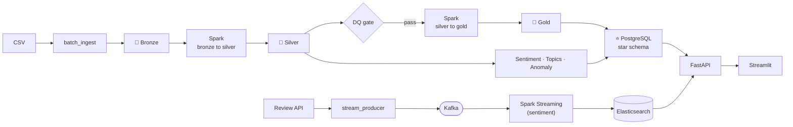

# 🛒 E-Commerce Review Intelligence Platform

<p>
  
  
  
  
  
  
  
  
  
  
</p>

> **End-to-end batch + real-time data platform for e-commerce reviews.**
> Kafka streaming, a Spark-powered **Bronze → Silver → Gold** data lake on MinIO,
> **data-quality gates**, a **PostgreSQL star schema**, and a sentiment / topic /
> anomaly ML layer — all served through FastAPI, Elasticsearch and a Streamlit dashboard.

This project began as a DistilBERT sentiment API and was **re-engineered into a full
data-engineering platform** to demonstrate ingestion, lake modelling, orchestration,
data quality and dimensional warehousing — not just model inference.

---

## 🏗️ Architecture



Full write-up: **[docs/ARCHITECTURE.md](docs/ARCHITECTURE.md)**.

---

## ✨ What it demonstrates

**Data Engineering**
- **Batch & streaming ingestion** (CSV + a mock review API into Kafka)
- **Medallion data lake** on MinIO/S3 — Bronze (raw) / Silver (clean) / Gold (marts)
- **Apache Spark** batch jobs + **Structured Streaming** for real-time sentiment
- **Data quality gate** — declarative expectations, pipeline fails on violation
- **Dimensional modelling** — a PostgreSQL **star schema** (`fact_reviews` + 4 dims)
- **Airflow** DAG orchestrating the nightly batch pipeline
- Containerised with **Docker Compose**; experiment tracking via **MLflow**

**Data Science**
- **Sentiment** (fine-tuned DistilBERT, 1–5 stars) with a lexicon fallback
- **Topic analysis** (TF-IDF + KMeans) — surfaces quality / shipping / price / …
- **Fake-review & anomaly detection** — rating vs. sentiment mismatch, near-duplicate
  spam, and IsolationForest outliers
- **Vector search** over reviews in Elasticsearch (dense embeddings)

---

## 📁 Repository layout

```text
config/       central env-driven settings + client factories
ingestion/    synthetic generator, mock review API, batch + Kafka stream
lake/         Bronze/Silver/Gold S3 helpers
spark/        bronze->silver, silver->gold, structured-streaming sentiment
dq/           declarative data-quality suite + engine
warehouse/    star-schema DDL + loader (PostgreSQL)
ml/           sentiment, topic model, anomaly detection, training
serving/      Elasticsearch vector indexing
dbt/          dbt models + data tests on the warehouse
tests/        pytest suite (offline components)
airflow/dags/ batch pipeline orchestration
api/          FastAPI analytics service
dashboard/    Streamlit dashboard
docs/         architecture
```

---

## 🚀 Quickstart

```bash
# 1. clone & configure
cp .env.example .env

# 2. start the stack (Kafka, MinIO, Postgres, Spark, ES, Mongo, MLflow, API, dashboard)
docker compose up -d

# 3. run the batch pipeline end-to-end
make seed        # generate a synthetic reviews CSV
make batch       # ingest -> data-quality gate -> warehouse load

# 4. explore
#   Dashboard     -> http://localhost:8501
#   Analytics API -> http://localhost:8000/docs
#   Kafka UI      -> http://localhost:8080
#   MinIO console -> http://localhost:9001   (minioadmin / minioadmin)
#   MLflow        -> http://localhost:5000
```

Real-time path:

```bash
make stream                                # produce reviews into Kafka
spark-submit spark/streaming_sentiment.py  # score them as they arrive
```

Individual data-science stages (no infra required):

```bash
make dq          # data-quality suite
make topics      # TF-IDF topic analysis
make anomalies   # fake-review / anomaly detection
```

---

## ✅ What's verified

The **infra-free components are tested and working**: synthetic generation, the
data-quality engine (6/6 checks), lexicon sentiment, TF-IDF topic modelling and
anomaly detection all run from a clean checkout (see the commands above). The
Spark / Kafka / warehouse stages are written against the bundled `docker-compose`
stack and run with `make up` + `make batch`.

> **Data honesty:** all reviews are **synthetically generated** with transparent
> rules (`ingestion/synthetic_reviews.py`) — no scraped or private data. A small,
> controlled share of anomalies is injected on purpose so the fake-review detector
> has something to find.

---

## 🧪 Testing & quality

```bash
ruff check .     # lint (enforced in CI)
pytest -q        # 13 unit tests, run in ~2s from a clean checkout
```

- **CI** — GitHub Actions runs `ruff` + `pytest` on every push & PR
- **Unit tests** cover the synthetic generator, the data-quality engine (pass **and**
  fail cases), sentiment, anomaly detection, and lake/config helpers
- **dbt tests** enforce warehouse integrity (`not_null`, `unique`, `accepted_values`,
  `relationships`) — see [`dbt/`](dbt/)

---

## 🛠️ Tech stack

`Python` · `Apache Kafka` · `Apache Spark (batch + Structured Streaming)` ·
`Apache Airflow` · `PostgreSQL` · `MinIO (S3)` · `MongoDB` · `Elasticsearch` ·
`dbt` · `MLflow` · `FastAPI` · `Streamlit` · `Docker Compose` · `DistilBERT / scikit-learn` · `pytest` · `ruff`

---

## 🗺️ Roadmap

- **v1 (this repo):** Kafka, MinIO lake, Spark, PostgreSQL star schema, DQ gate,
  FastAPI, sentiment model, Docker Compose
- **v2:** Great Expectations suite, richer Airflow SLAs, MLflow model registry,
  BERTopic, Grafana boards, dbt models on the warehouse

---

## 📄 License

Released under the [MIT License](LICENSE).
