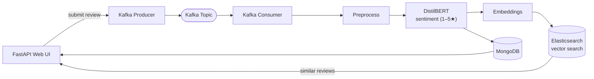

# Amazon Customer Reviews Sentiment Analysis

<p>
  
  
  
  
  
  
</p>

A comprehensive, production-ready sentiment analysis platform for Amazon product reviews. This project leverages fine-tuned DistilBERT models, real-time streaming with Kafka, vector search with Elasticsearch, and a modern FastAPI web interface.

## 🚀 Features

- **🤖 Fine-tuned DistilBERT Model**: Accurately classifies Amazon reviews into 1-5 star ratings
- **⚡ Real-time Streaming**: Kafka-based message queuing for scalable processing
- **🔍 Vector Search**: Elasticsearch-powered similarity search for finding related reviews
- **🌐 Modern Web Interface**: FastAPI-powered interactive web application
- **📊 Comprehensive Analytics**: Detailed evaluation metrics and visualizations
- **🐳 Docker Support**: Complete containerized deployment with Docker Compose
- **💾 MongoDB Integration**: Scalable data storage and retrieval
- **🔄 Automated Pipeline**: End-to-end data preprocessing and model training

## 🏗️ Architecture



## 📋 Prerequisites

- Python 3.8+
- Docker & Docker Compose
- 8GB+ RAM (for model training)
- CUDA-compatible GPU (optional, for faster training)

## 🛠️ Installation

### Option 1: Docker Setup (Recommended)

1. **Clone the repository:**
   ```bash
   git clone https://github.com/yagmurtncr/Amazon-Customer-Reviews-Sentiment-Analysis.git
   cd Amazon_Ratings
   ```

2. **Start all services:**
   ```bash
   cd services
   docker-compose up -d
   ```

3. **Wait for services to initialize** (about 2-3 minutes)

4. **Initialize Elasticsearch:**
   ```bash
   python services/elasticsearch_init.py
   ```

### Option 2: Local Development Setup

1. **Clone and setup:**
   ```bash
   git clone https://github.com/yagmurtncr/Amazon-Customer-Reviews-Sentiment-Analysis.git
   cd Amazon_Ratings
   python -m venv .venv
   .venv\Scripts\activate  # Windows
   # source .venv/bin/activate  # Linux/Mac
   ```

2. **Install dependencies:**
   ```bash
   pip install -r requirements.txt
   ```

3. **Start services manually:**
   - MongoDB: `mongod`
   - Elasticsearch: `elasticsearch`
   - Kafka + Zookeeper: Use Docker Compose or local installation

## 🚀 Quick Start

### 1. Data Preparation
```bash
# Import CSV data to MongoDB
python services/csv_to_mongo.py

# Preprocess and split data
python preprocess.py
```

### 2. Model Training
```bash
# Train DistilBERT model
python train_model.py
```

### 3. Start the Web Application
```bash
# Start FastAPI server
uvicorn app:app --reload --host 0.0.0.0 --port 8000
```

### 4. Access the Application
- **Web Interface**: http://localhost:8000
- **API Documentation**: http://localhost:8000/docs
- **Kafka UI**: http://localhost:8080 (if using Docker)

## 📁 Project Structure

```
Amazon_Ratings/
├── 📄 app.py                    # FastAPI web application
├── 📄 train_model.py           # Model training script
├── 📄 preprocess.py            # Data preprocessing
├── 📄 evaluate.py             # Model evaluation
├── 📄 postprocess.py          # Inference utilities
├── 📄 test_model.py           # Model testing
├── 📁 services/                # Microservices
│   ├── 📄 docker-compose.yml  # Docker services
│   ├── 📄 db_config.py        # MongoDB configuration
│   ├── 📄 kafka_producer.py   # Kafka message producer
│   ├── 📄 kafka_consumer.py   # Kafka message consumer
│   ├── 📄 embedding_utils.py  # Vector embeddings
│   ├── 📄 elasticsearch_init.py # ES initialization
│   ├── 📄 csv_to_mongo.py     # Data import utility
│   └── 📄 kafbat-config.yml   # Kafka UI configuration
├── 📁 amazon_data/            # Raw data files (gitignored)
├── 📁 sentiment_model_distilbert/ # Model checkpoints (gitignored)
├── 📁 results/                # Evaluation outputs (gitignored)
├── 📁 templates/              # HTML templates
├── 📁 static/                 # Static assets (CSS, JS)
└── 📄 requirements.txt        # Python dependencies
```

> **Note**: `amazon_data/`, `sentiment_model_distilbert/`, and `results/` folders are gitignored due to large file sizes. These will be created when you run the data preparation and training scripts.

## ⚙️ Configuration

### Environment Variables
Create a `.env` file in the root directory:
```env
# MongoDB Configuration
MONGO_USERNAME=mongoadmin
MONGO_PASSWORD=secret
MONGO_HOST=localhost
MONGO_PORT=27017
MONGO_DB_NAME=amazon_ratings

# Kafka Configuration
KAFKA_BOOTSTRAP_SERVERS=localhost:9092
KAFKA_TOPIC_NAME=reviews

# Elasticsearch Configuration
ELASTICSEARCH_URL=http://localhost:9200
ELASTICSEARCH_INDEX=reviews_vector

# Model Configuration
MODEL_PATH=./sentiment_model_distilbert
MAX_SEQUENCE_LENGTH=512
```

### Docker Services
The `docker-compose.yml` includes:
- **Kafka + Zookeeper**: Message streaming
- **MongoDB**: Document database
- **Elasticsearch**: Vector search engine
- **Kafka UI**: Web interface for Kafka management

## 📊 API Endpoints

### Web Interface
- `GET /` - Main sentiment analysis interface
- `POST /predict` - Analyze review sentiment

### REST API
- `GET /docs` - Interactive API documentation
- `GET /openapi.json` - OpenAPI specification

## 🧪 Usage Examples

### Web Interface
1. Navigate to http://localhost:8000
2. Enter an Amazon product review
3. Click "Tahmin Et" to get sentiment analysis
4. View similar reviews and confidence scores

### Command Line Testing
```bash
# Test model with sample text
python test_model.py

# Evaluate model performance
python evaluate.py
```

### Programmatic Usage
```python
from postprocess import predict_sentiment

# Analyze sentiment
result = predict_sentiment("This product is amazing!")
print(result)  # {'distilbert': '★★★★☆'}
```

## 🔍 Troubleshooting

### Common Issues

1. **Kafka Connection Error**
   ```bash
   # Check if Kafka is running
   docker-compose ps
   # Restart Kafka
   docker-compose restart kafka
   ```

2. **Elasticsearch Connection Error**
   ```bash
   # Check Elasticsearch status
   curl http://localhost:9200
   # Initialize index
   python services/elasticsearch_init.py
   ```

3. **MongoDB Connection Error**
   ```bash
   # Check MongoDB connection
   python services/test_MongoDB.py
   ```

4. **Model Loading Error**
   ```bash
   # Ensure model files exist
   ls -la sentiment_model_distilbert/
   # Retrain if necessary
   python train_model.py
   ```

### Performance Optimization

- **GPU Acceleration**: Install CUDA-compatible PyTorch
- **Memory Management**: Adjust batch sizes in training scripts
- **Caching**: Enable model caching for faster inference

## 📈 Model Performance

The fine-tuned DistilBERT model achieves:
- **Accuracy**: ~85-90% on Amazon review classification
- **Inference Speed**: ~50ms per prediction
- **Model Size**: ~250MB (efficient for production)

