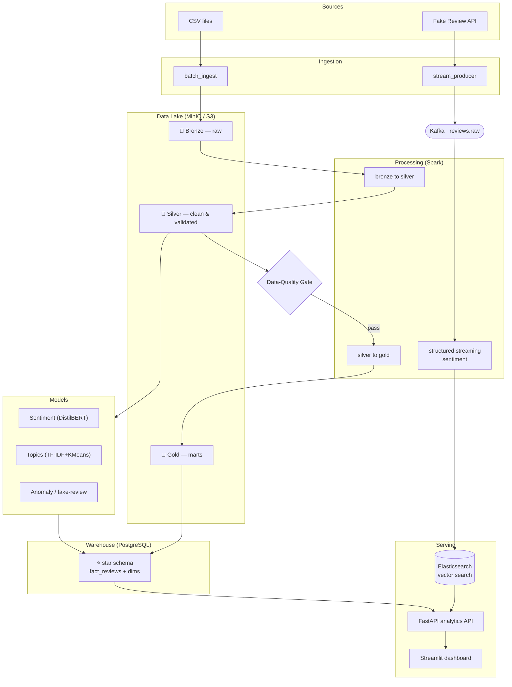

# Architecture

The platform ingests e-commerce reviews from **batch** and **streaming** sources,
lands them in a **Bronze → Silver → Gold** data lake, gates them with **data-quality
checks**, models them into a **PostgreSQL star schema**, enriches them with
**sentiment / topic / anomaly** models, and serves analytics through a **FastAPI +
Streamlit** layer. **Airflow** orchestrates the batch path; **Spark Structured
Streaming** handles the real-time path.

## Batch vs. streaming

| Path | Trigger | Tools | Output |
|------|---------|-------|--------|
| **Batch** | nightly (Airflow) | CSV → Bronze → Spark → DQ → Gold → Warehouse | star schema, Gold marts |
| **Streaming** | continuous | Kafka → Spark Structured Streaming → sentiment | `reviews.scored`, ES index |

## Medallion layers

- **Bronze** — raw, immutable, append-only, partitioned by ingest date (replayable)
- **Silver** — cleaned, de-duplicated, typed, validated; engineered features
  (`review_length`, `word_count`, `review_year/month`)
- **Gold** — aggregated marts (`daily_category_sentiment`, `product_summary`,
  `topic_distribution`) ready for BI and the warehouse

## Dimensional model (star schema)

`fact_reviews` (grain = one review) references conformed dimensions
`dim_product`, `dim_customer`, `dim_date`, `dim_category`. See
[`warehouse/ddl/star_schema.sql`](../warehouse/ddl/star_schema.sql).
